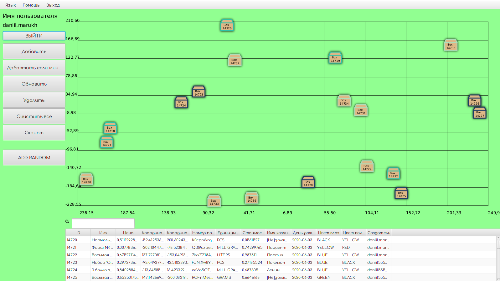

# ITMO_RobotSystem_lab8
## Лабораторная работа #8 по программированию

Модуль|Назначение
----- | ----
[`Server`](Server)  | Серверный модуль
[`Client`](Client)  | Клиентское приложение с графическим интерфейсом
[`Spamer`](Spamer) | Консольный спам-клиент
------------

## Серверный модуль:
### Работа:
- Настройка сервера происходит в [.properties](Server/src/main/resources/config.properties) файле, создаваемом при первом запуске программы
- Логирование вервера реализовано при молощи 'log4j'
- Хранит объекты в таблицах базы данных, создаваемых при инициализации
### Многопоточность:

- Для многопотчной обработки полученного запроса использьзуется`Fixed thread pool`
- Для многопоточной отправки ответа используется `Fixed thread pool`
- Для синхронизации доступа к коллекции используется синхронизация чтения и записи с помощью `java.util.concurrent.locks.ReadWriteLock`

### Взаимодействие с почтовым сервером:
- Режим работы почтового модуля устанавивается в [.properties](Server/src/main/resources/config.properties) файле.
- Отправка письма происходит при регистрации нового пользователя на указанный почтовый адрес.
- Письмо, содержащее логин и проверочный код, формируется из [html](Server/src/main/resources/emailTemplate.html) шаблона
____
## Клиентский модуль:
### Особенности:
- Реализован с использвоанием Kotlin и TornadoFX (для запуска необходима установка javaFX)
- Реализует возможность соединения с сервером, авторизации, регистрации, ввода проверочного кода и работы с коллекцией
- Отоброжает объекты в виде сортируемой таблицы с воззможностью поиска и в графическом представлении на координатном поле
- Поддерживает команды добавления, удаления и изменения объектов, а так же выколнения скрипта, содержащего эти команды в файле.
### Локализация
- Реальзована поддержка 5 языков: русского, английского, французского, испанского(Гондурас) и финского
- Переключение возможно осуществить в любой момент работы программы
____
## Соединение:
Для связи клиента и сервера искользуется `UDP`, реализованный в пакете [Connector](Connector)
